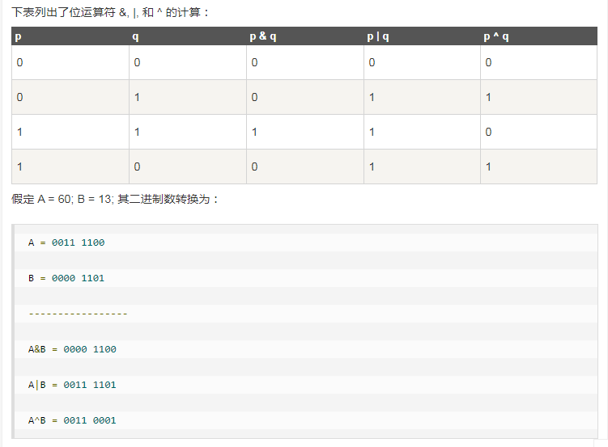
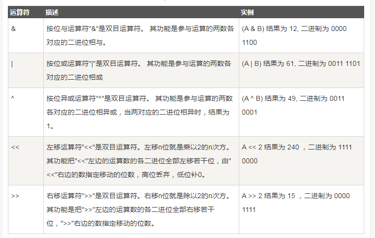

## 位运算符

> 位运算符对整数在内存中的二进制位进行操作。

```
下表列出了位运算符 &, |, 和 ^ 的计算：
```



```
Go 语言支持的位运算符如下表所示。假定 A 为60，B 为13：
```



```go
package main

/*
位运算符对整数在内存中的二进制位进行操作

*/

import "fmt"

func main() {

	var a uint = 60 /* 60 = 0011 1100 */
	var b uint = 13 /* 13 = 0000 1101 */
	var c uint = 0

	c = a & b /* 12 = 0000 1100 */
	fmt.Printf("第一行 - c 的值为 %d\n", c)

	c = a | b /* 61 = 0011 1101 */
	fmt.Printf("第二行 - c 的值为 %d\n", c)

	c = a ^ b /* 49 = 0011 0001 */
	fmt.Printf("第三行 - c 的值为 %d\n", c)

	c = a << 2 /* 240 = 1111 0000 */
	fmt.Printf("第四行 - c 的值为 %d\n", c)

	c = a >> 2 /* 15 = 0000 1111 */
	fmt.Printf("第五行 - c 的值为 %d\n", c)

}

输出结果:
    第一行 - c 的值为 12
    第二行 - c 的值为 61
    第三行 - c 的值为 49
    第四行 - c 的值为 240
    第五行 - c 的值为 15
```

