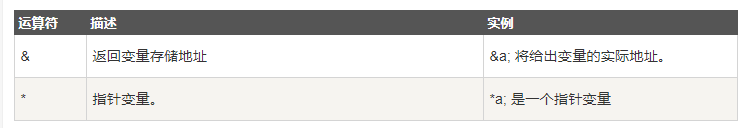

## 其他运算符

> 下表列出了Go语言的其他运算符。



以下实例演示了其他运算符的用法：

```go
package main

import "fmt"

func main() {
	var a int = 4
	var b int32
	var c float32
	var ptr *int

	/* 运算符实例 */
	fmt.Printf("第 1 行 - a 变量类型为 = %T\n", a)
	fmt.Printf("第 2 行 - b 变量类型为 = %T\n", b)
	fmt.Printf("第 3 行 - c 变量类型为 = %T\n", c)

	/*  & 和 * 运算符实例 */
	ptr = &a /* 'ptr' 包含了 'a' 变量的地址 */
	fmt.Printf("a 的值为  %d\n", a)
	fmt.Printf("*ptr 为 %d\n", *ptr)
}
输出结果:
    第 1 行 - a 变量类型为 = int
    第 2 行 - b 变量类型为 = int32
    第 3 行 - c 变量类型为 = float32
    a 的值为  4
    *ptr 为 4
```

