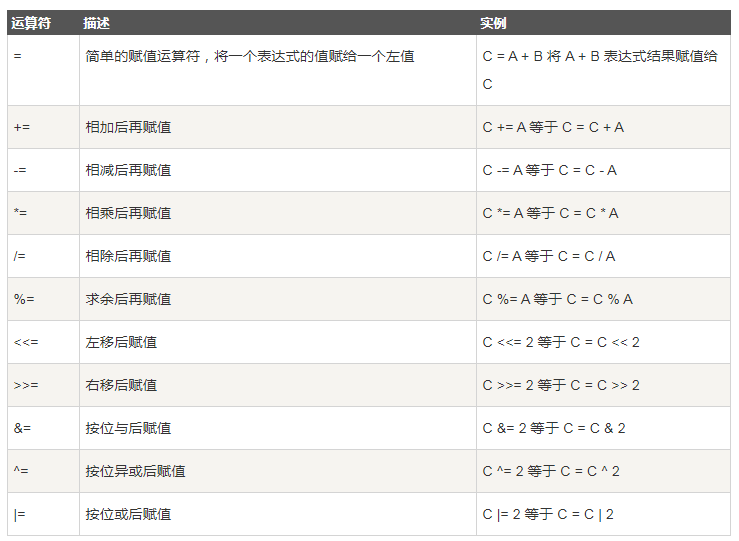

## 赋值运算符

>下表列出了所有Go语言的赋值运算符。



实例:

```go
package main

import "fmt"

func main() {
	var a int = 21
	var c int

	c = a
	fmt.Printf("第 1 行 - =  运算符实例，c 值为 = %d\n", c)

	c += a
	fmt.Printf("第 2 行 - += 运算符实例，c 值为 = %d\n", c)

	c -= a
	fmt.Printf("第 3 行 - -= 运算符实例，c 值为 = %d\n", c)

	c *= a
	fmt.Printf("第 4 行 - *= 运算符实例，c 值为 = %d\n", c)

	c /= a
	fmt.Printf("第 5 行 - /= 运算符实例，c 值为 = %d\n", c)

	c = 200
	c <<= 2
	fmt.Printf("第 6行  - <<= 运算符实例，c 值为 = %d\n", c)

	c >>= 2
	fmt.Printf("第 7 行 - >>= 运算符实例，c 值为 = %d\n", c)

	c &= 2
	fmt.Printf("第 8 行 - &= 运算符实例，c 值为 = %d\n", c)

	c ^= 2
	fmt.Printf("第 9 行 - ^= 运算符实例，c 值为 = %d\n", c)

	c |= 2
	fmt.Printf("第 10 行 - |= 运算符实例，c 值为 = %d\n", c)

}

运行结果:
    第 1 行 - =  运算符实例，c 值为 = 21
    第 2 行 - += 运算符实例，c 值为 = 42
    第 3 行 - -= 运算符实例，c 值为 = 21
    第 4 行 - *= 运算符实例，c 值为 = 441
    第 5 行 - /= 运算符实例，c 值为 = 21
    第 6行  - <<= 运算符实例，c 值为 = 800
    第 7 行 - >>= 运算符实例，c 值为 = 200
    第 8 行 - &= 运算符实例，c 值为 = 0
    第 9 行 - ^= 运算符实例，c 值为 = 2
    第 10 行 - |= 运算符实例，c 值为 = 2
```

