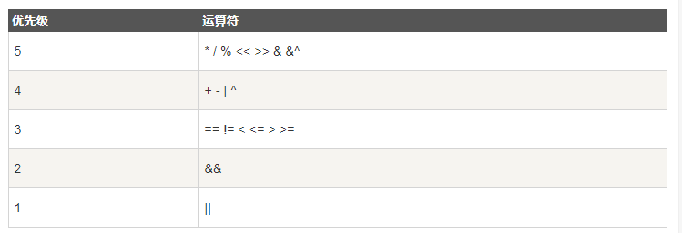

## 运算符优先级

> 有些运算符拥有较高的优先级，二元运算符的运算方向均是从左至右。下表列出了所有运算符以及它们的优先级，由上至下代表优先级由高到低：



> 当然，你可以通过使用括号来临时提升某个表达式的整体运算优先级。

```go
package main

import "fmt"

func main() {
	var a int = 20
	var b int = 10
	var c int = 15
	var d int = 5
	var e int
	e = (a + b) * c / d // ( 30 * 15 ) / 5
	fmt.Printf("(a + b) * c / d 的值为 : %d\n", e)
	e = ((a + b) * c) / d // (30 * 15 ) / 5
	fmt.Printf("((a + b) * c) / d 的值为  : %d\n", e)
	e = (a + b) * (c / d) // (30) * (15/5)
	fmt.Printf("(a + b) * (c / d) 的值为  : %d\n", e)
	e = a + (b*c)/d //  20 + (150/5)
	fmt.Printf("a + (b * c) / d 的值为  : %d\n", e)
}
输出结果:
    (a + b) * c / d 的值为 : 90
    ((a + b) * c) / d 的值为  : 90
    (a + b) * (c / d) 的值为  : 90
     a + (b * c) / d 的值为  : 50
```

